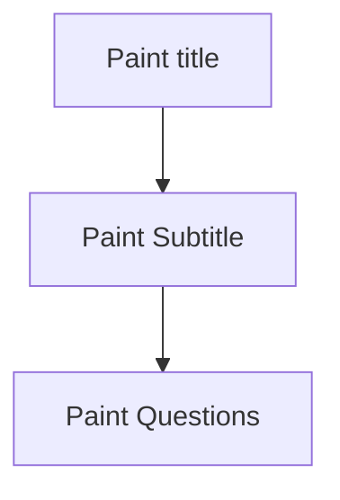

## Every function sould do just one thing
Here I have this code: 

```js
const paintSection = (section: number) => {
    const sectionTemp = sections[section];
    return (
      <>
        <h2>{sectionTemp.title}</h2>
        <p>{sectionTemp.desc}</p>
        {sectionTemp.questions &&
          sectionTemp.questions.map((question: any, idxQuestion: any) => {
            return (
              <div key={question.title}>
                <b>
                  {idxQuestion + 1}.- {question.title}
                </b>
                {question.idQuestionType == 1 ? (
                  <div>
                    <Form.Control
                      id={`pregunta-${question.idQuestionType}`}
                      as="textarea"
                      value={question.answer}
                      rows={3}
                      onChange={(event) => {
                        setAnswer({
                          idxQuestion,
                          section,

                          idQuestion: question.idQuestion,
                          idQuestionType: question.idQuestionType,
                          value: event.target.value,
                        });
                      }}
                    />
                  </div>
                ) : question.idQuestionType == 3 ? (
                  <div>
                    {question.options &&
                      question.options.map((option, idxOption) => (
                        <Form.Check
                          key={idxOption}
                          type={"checkbox"}
                          id={`pregunta-${question.idQuestionType}`}
                          checked={option.Opcion.checked}
                          label={option.Opcion.opcion}
                          onChange={(event) => {
                            setAnswer({
                              section,
                              idxQuestion,
                              idxOption,
                              idQuestion: question.idQuestion,
                              idQuestionType: question.idQuestionType,
                              idOption: option.Opcion,
                              value: event.target.checked,
                            });
                          }}
                        />
                      ))}
                  </div>
                ) : (
                  question.idQuestionType == 2 && (
                    <div>
                      {question.options &&
                        question.options.map((option, idxOption) => (
                          <Form.Check
                            key={idxOption}
                            type={"radio"}
                            id={`pregunta-${question.idQuestionType}`}
                            checked={option.Opcion.checked}
                            label={option.Opcion.opcion}
                            onChange={(event) => {
                              setAnswer({
                                section,
                                idxQuestion,
                                idxOption,
                                idQuestion: question.idQuestion,
                                idQuestionType: question.idQuestionType,
                                idOption: option.Opcion,

                                value: event.target.checked,
                              });
                            }}
                          />
                        ))}
                    </div>
                  )
                )}
              </div>
            );
          })}
      </>
    );
  };
 ```
 
 Is very dificult try to understand what's happening here. 
 
 Before all, sections and section are states. 
 
 Follow the instruction i will divide the paintSection funcion in their tasks:


Notice that Paint Questions is a plural, so I will separete this task in other functions, the result in paintSections is:

```js

 const paintSection = (section: number) => {
    const sectionTemp = sections[section];
    return (
      <>
        <h2>{sectionTemp.title}</h2>
        <p>{sectionTemp.desc}</p>
        {sectionTemp.questions && paintQuestions(questions)}
      </>
      )
  };
```
Now the paintQuestions function look like this: 

```js
 const paintQuestions = (questions:any) => {
    questions.map((question: any, idxQuestion: any) => {
      return (
        <div key={question.title}>
          <b>
            {idxQuestion + 1}.- {question.title}
          </b>
          {question.idQuestionType == 1 ? (
            <div>
              <Form.Control
                id={`pregunta-${question.idQuestionType}`}
                as="textarea"
                value={question.answer}
                rows={3}
                onChange={(event) => {
                  setAnswer({
                    idxQuestion,
                    section,

                    idQuestion: question.idQuestion,
                    idQuestionType: question.idQuestionType,
                    value: event.target.value,
                  });
                }}
              />
            </div>
          ) : question.idQuestionType == 3 ? (
            <div>
              {question.options &&
                question.options.map((option, idxOption) => (
                  <Form.Check
                    key={idxOption}
                    type={"checkbox"}
                    id={`pregunta-${question.idQuestionType}`}
                    checked={option.Opcion.checked}
                    label={option.Opcion.opcion}
                    onChange={(event) => {
                      setAnswer({
                        section,
                        idxQuestion,
                        idxOption,
                        idQuestion: question.idQuestion,
                        idQuestionType: question.idQuestionType,
                        idOption: option.Opcion,
                        value: event.target.checked,
                      });
                    }}
                  />
                ))}
            </div>
          ) : (
            question.idQuestionType == 2 && (
              <div>
                {question.options &&
                  question.options.map((option, idxOption) => (
                    <Form.Check
                      key={idxOption}
                      type={"radio"}
                      id={`pregunta-${question.idQuestionType}`}
                      checked={option.Opcion.checked}
                      label={option.Opcion.opcion}
                      onChange={(event) => {
                        setAnswer({
                          section,
                          idxQuestion,
                          idxOption,
                          idQuestion: question.idQuestion,
                          idQuestionType: question.idQuestionType,
                          idOption: option.Opcion,

                          value: event.target.checked,
                        });
                      }}
                    />
                  ))}
              </div>
            )
          )}
        </div>
      );
    })}
  }
```

Avoiding the loop, I show the diagram inside of this: 
 ```mermaid
flowchart
A[Paint question title]
B{Question type}
C[Paint Open Question]
D[Paint Radio Question]
E[Paint checkbox Question]
A --> B
B-->C
B-->D
B-->E
```
In this case, I didn't get to a point where the new task is several times the same. In this point I have 3 options, by this reason i need 3 new functions. Finally, the function paint questions look like this: 
```js
const paintQuestions = (questions:any) => {
    questions.map((question: any, idxQuestion: any) => (
        <div key={question.title}>
          <b>
            {idxQuestion + 1}.- {question.title}
          </b>
          {question.idQuestionType == 1 && paintOpenQuestion(question)} 
          {question.idQuestionType == 2 && paintRadioQuestion(question)}
          {question.idQuestionType == 3 && paintCheckboxQuestion(question)}
        </div>
      ))}
  }
  ```
Very much easy to understand. The final result is: 


```js
const paintSection = (section: number) => {
    const sectionTemp = sections[section];
    console.log("sectionTemp: ",sectionTemp);
    return (
      <>
        <h2>{sectionTemp.title}</h2>
        <p>{sectionTemp.desc}</p>
        {sectionTemp.questions && paintQuestions(sectionTemp.questions)}
      </>
      )
  };
  const paintQuestions = (questions:any) => (
    questions.map((question: any, idxQuestion: any) => (
        <div key={question.title}>
          <b>
            {idxQuestion + 1}.- {question.title}
          </b>
          {question.idQuestionType == 1 && paintOpenQuestion(question)} 
          {question.idQuestionType == 2 && paintRadioQuestion(question)}
          {question.idQuestionType == 3 && paintCheckboxQuestion(question)}
        </div>
      ))
  )


  const paintOpenQuestion = (question:any) =>(
      <div>
        <Form.Control
          id={`pregunta-${question.idQuestionType}`}
          as="textarea"
          value={question.answer}
          rows={3}
          onChange={(event) => {
            setAnswer();
          }}
        />
      </div>
    )
  
  
  const paintRadioQuestion = (question) => (
      <div>
        {question.options &&
          question.options.map((option, idxOption) => (
            <Form.Check
              key={idxOption}
              type={"radio"}
              id={`pregunta-${question.idQuestionType}`}
              checked={option.Opcion.checked}
              label={option.Opcion.opcion}
              onChange={(event) => {
                setAnswer();
              }}
            />
          ))}
      </div>
  )
  const paintCheckboxQuestion = (question) => (
      <div>
        {question.options &&
          question.options.map((option, idxOption) => (
            <Form.Check
              key={idxOption}
              type={"checkbox"}
              id={`pregunta-${question.idQuestionType}`}
              checked={option.Opcion.checked}
              label={option.Opcion.opcion}
              onChange={(event) => {
                setAnswer();
              }}
            />
          ))}
      </div>
  )  
  ```

